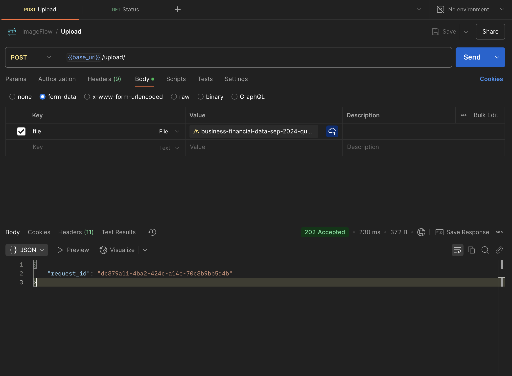
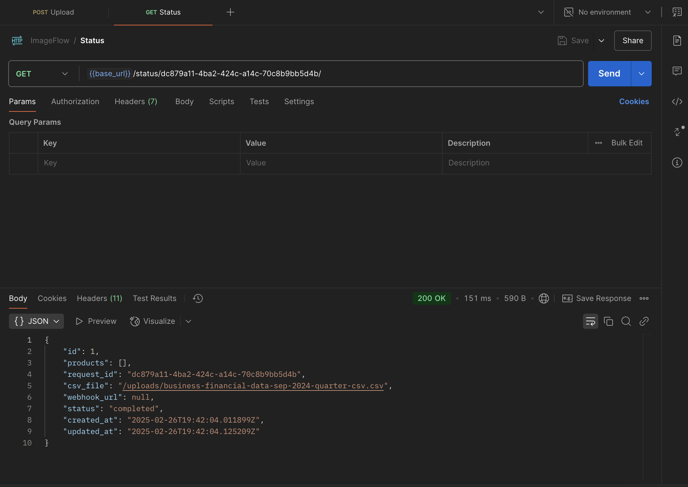

# Low-Level Design (LLD)
**Overview**:
ImageFlow is built to efficiently process CSV files containing product image URLs. The system accepts a CSV file, validates and stores its data, processes images asynchronously (simulated via URL modification), and provides status tracking. Optionally, a webhook is triggered upon completion.

# Component Breakdown
## API Endpoints

**CSV Upload API**:
Accepts a CSV file (and optional webhook URL).
Validates and parses CSV content.
Creates a unique processing request and product records.
Enqueues an asynchronous task via Celery.
**Status API**:
Retrieves processing status and details using the unique request ID.

## Database Models:

**ProcessingRequest**:
Stores CSV file metadata, processing status, and webhook URL.
**Product**:
Stores individual product details, including input and output image URLs.

## Asynchronous Processing (Celery)

**Task (process_csv_images)**:
Fetches the processing request.
Processes each product (simulates image compression).
Updates output image URLs and processing status.
Optionally triggers a webhook callback upon completion.
Webhook Integration (Bonus):

Sends an HTTP POST request to the provided webhook URL with the processing result.

## Logging & Documentation:

Detailed logging is implemented throughout.
Code includes comprehensive docstrings, inline comments, and type annotations.


# Visual System Diagram

Checkout `ImageFlow.drawio` at root level

**OR**

```bash
https://drive.google.com/file/d/1JUWTctS0GNGWX2IomNhQdultd-rRSBqN/view?usp=sharing
```

# Swagger API Documentation

```bash
http://localhost:8000/swagger
```

# Postman Collection

Checkout `ImageFlow.postman_collection.json` at root level

**OR**

```bash
https://drive.google.com/file/d/1KcDuw-hABvE3XXRcUSVsHsC5eGtSXit_/view?usp=sharing
```

## API Results

**Upload API**



**Status API**


